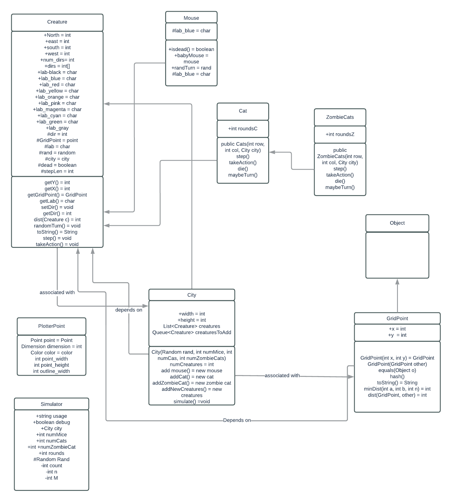

# OOP Design Document

## Overview

## Cat
My cat class extends the creature, and contains methods that use a step function, a takeAction function, a die, and a maybeTurn. The cat needs to search 20 rounds to find a mouse, and if it foinds a mouse, it moves towards the mouse using the step function, and it will change its color to cyan. If it can't find the mouse, it will be displayed normally as yellow. I use a die fuction to delete the cat from the program if it does not eat a mouse within 50 rounds, so it will turn into a zombie cat. I will use a Random variable to also proedict when it will turn. I will use the abstract takeAction as a polymorphic function call in this class too.
## Mouse
I will extend the creature class to create the mouse class, so it will inherit all of the methods and variables from the creature class. The mouse class (and all of the other objects) are polymorphic calls of the creature. the methods that I will have are isDead, newMouse, randTurn. I will also set my color to be blue, as specified in the requirements. I will use these methods to calculate when the mouse should produce a new baby, when the mouse should die, when it turns, and its color.  I will use the abstract takeAction as a polymorphic function call in this class too.

## Zombie cat
My zombie cat will extend my cat class, so it will inherit from both the cat and the Creature. This is another example of polymorphism. My zombieCats will include all of the same attributes of cat and also of creature. So, we will need to have methods to create new zombieCats, step, make new zombiecats, take an action, maybeTurn, and die. I will use the abstract takeAction as a polymorphic function call in this class too.

## ScaryDog
I will create another object that, if it is in proximity to the cats or mice, will eat everything. The ScaryDog will also extend the creatures class and have its own methods for the aforementioned actions: step, die, maybeTurn, and creating a new dog. I will use the abstract takeAction as a polymorphic function call in this class too.
